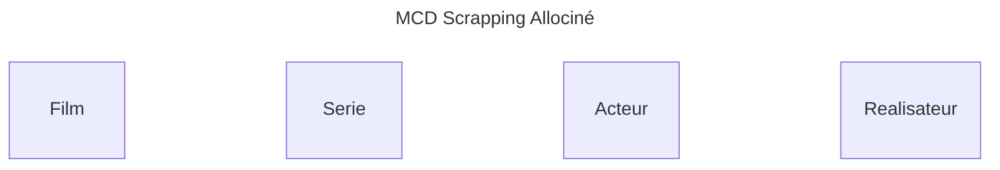
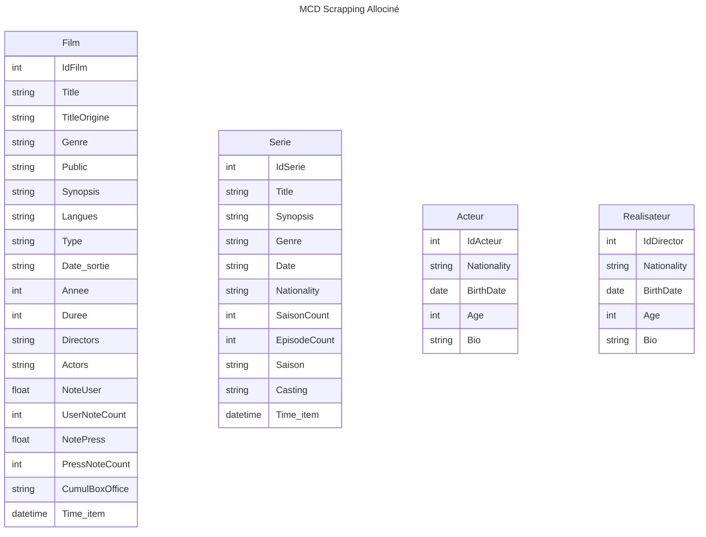
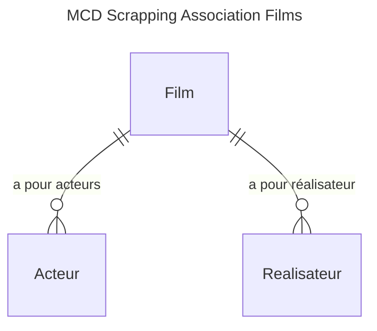

# brief_scraping_scrapy

## Contexte
Vous êtes cinéphile et vous souhaitez vous créer une base de données personnelle pour rechercher vos films et séries préférés.

## Objectifs
- Récolter des données en scrapant le site web [Allociné](https://www.allocine.fr)..
- Constituer une base de donnée.
- Intégrer la base de donnée dans [Azure](https://azure.microsoft.com).
- Automatisation du scrapping, et prévoir une pipeline de nettoyage des données.
- Stocker les données dans une base de données Postgres sous [Azure](https://azure.microsoft.com).

## Les données à scrapper

*Films*
- Titre: Titre du film
- Titre original : Titre original du film
- Score Presse : Note de la presse spécialisée 
- Score Utilisateurs : Note des utilisateurs
- Genre : Genre du film (comédie, drame, etc.) 
- Type : Type du film (Long métrage, etc.)
- Année : Année de sortie du film 
- Durée : Durée du film (en minutes) 
- Description : Synopsis du film 
- Acteurs : Liste des acteurs principaux 
- Réalisateur : Nom du réalisateur 
- Public : Classification du film (Tous publics, etc.) 
- Pays d'origine : Pays d'origine du film

*Pour les séries*
en plus des informations des Films
- Nombre de saisons : Nombre total de saisons
- Nombre d'épisodes : Nombre total d'épisodes

## Définition du modèle MCD (Modèle Conceptuel des Données)
### Les concepts
La prmière étape consiste à définr notre MCD, nous avons 

### Les attributs
La prmière étape consiste à définr notre MCD, nous avons 

## Les associations
 **FIlms**

 **Series**

